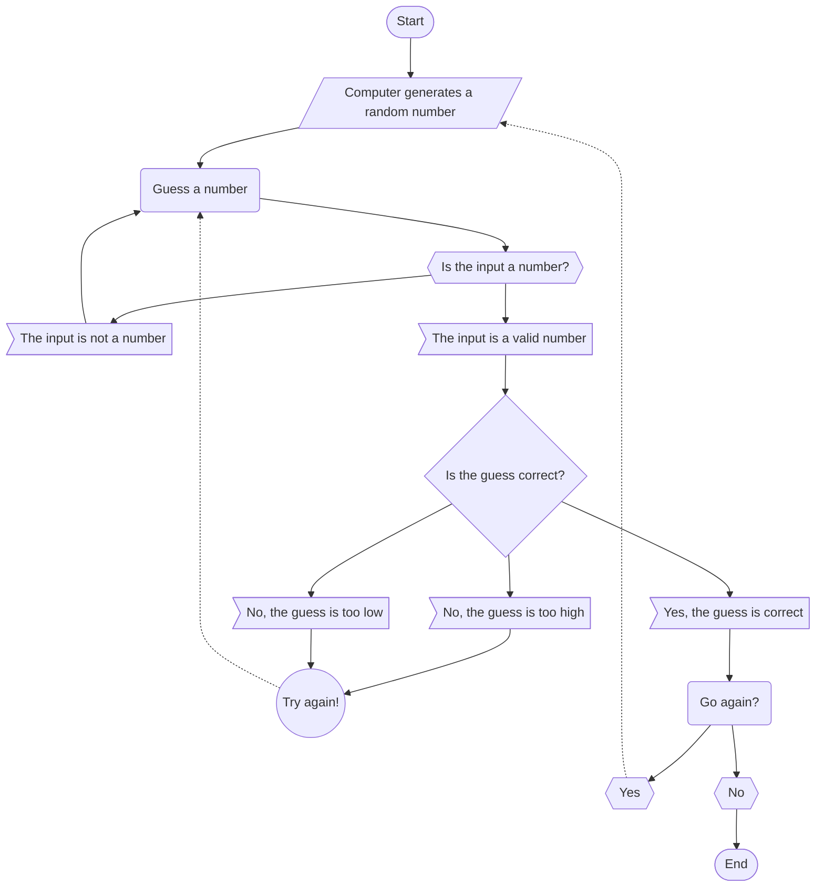

#### The program starts, and a random number is generated.
#### The user is prompted to guess a number.
#### If the input is a valid number, the code continues. If not, they are prompted to input a number again.
#### If the number inputted is not equal to the randomly generated number, the user is told if they guessed higher or lower than the actual number and are then prompted to guess again.
#### If the number inputted is equal to the randomly generated number, the user is asked if they want to play again.
#### If the user wants to play again, the process repeats and a new random number is generated.
#### If the user does not want to play again, the code ends.

